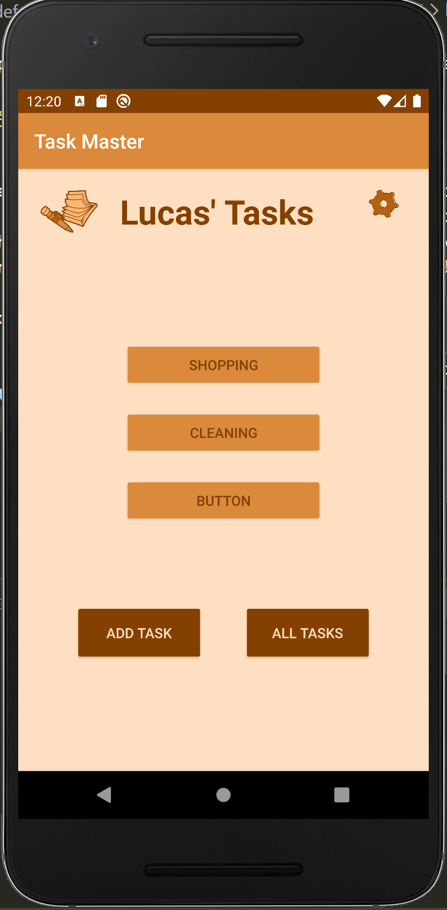

# taskmaster
This Android app helps users create and keep track of tasks they need to do!

## Changelog
- 2/11/2020: Created app. Added main activity, Add Task activity, and All Tasks activity, based on wireframes . Added buttons to start each activity from the home page. Added a button to submit a new task on the Add Task activity, and an onclick function for it with a "Submitted!" animation.

- 2/12/2020: Added a Settings activity and a TaskDetails activity. Added hardcoded task buttons to the homepage, which start the TaskDetails activity, and currently only update the title text on that. Added a gear image button which starts the Settings activity, which contains an input that allows the user to set their username, which is updated on the homepage to replace the "My" in "My Tasks".

- 2/14/2020: Added a new "City" theme to the app, and a theme selector on the Settings activity.

- 2/15/2020: Refactored the theme code. Added XML styles for each theme and removed (most) of the manual view color changes. Removed the action bar.

- 2/18/2020: Implemented a Room database to store Tasks. The RecyclerView on the Main activity now shows all stored tasks, and the Add Task activity can be used to add new Tasks.

- 2/19/2020: Added the Night theme. The recycler view on the Main activity now only shows task state and title, the task body is visible on the Task Details activity.

- 2/20/2020: Refactored app to use AWS Amplify instead of Room for task storage.

- 2/22/2020: Added Teams, which own Tasks. A user must now specify a team in Settings, and the main activity will display tasks assigned to that team. Added a spinner for team selection in both Settings and in Add Task. Also added task update and delete functionality. The main activity title is now the currently selected team. Adding spinners cause several complications with app styling, so the City and Night themes have been disabled for now.

- 2/25/2020: Added Amplify authentication. Signed-out users are now redirected to a Login activity on app start. Added a log out button to the Settings activity.

-3/01/2020: Added Amplify storage. Users can now attach an image to a task. Re-enabled theme selection, although theme styling is still broken on pages which contain spinners.